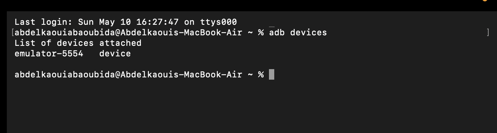
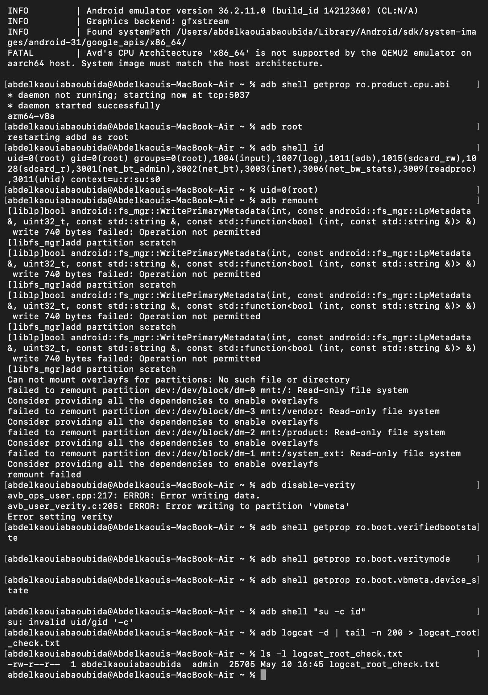
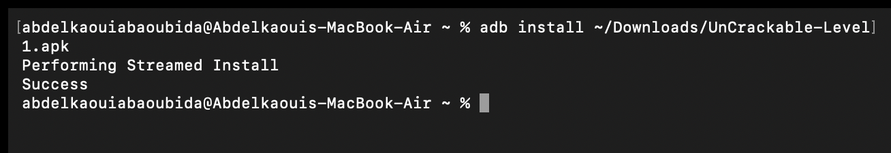
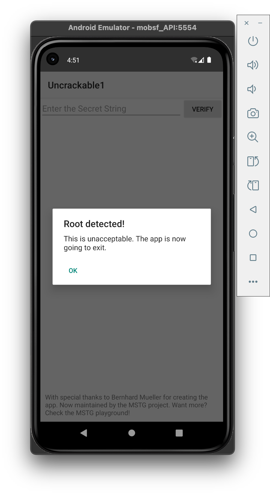

# Android Rooting & Verified Boot Lab

## Informations générales

- **Auteur** : Abdelkaoui Abaoubida
- **Support** : Android Virtual Device (AVD)
- **Application testée** : UnCrackable-Level1
- **Objectif** : Comprendre le rooting Android et ses impacts sur la sécurité
- **Données utilisées** : Données fictives uniquement
- **Réseau** : Réseau de laboratoire isolé

---

# Étape 1 — Vérification de l’AVD

Cette étape permet de vérifier que l’émulateur Android est correctement détecté par ADB avant de commencer les manipulations de sécurité.

## Commande exécutée

```bash
adb devices
```

## Résultat



Le terminal confirme que l’émulateur Android est détecté avec l’état `device`.

---

# Étape 2 — Root de l’AVD et vérifications système

L’objectif de cette étape est d’obtenir les privilèges root afin d’observer le comportement des protections Android.

## Vérifications réalisées

- Vérification de l’architecture CPU de l’AVD
- Activation du mode root avec `adb root`
- Vérification de l’utilisateur root avec `adb shell id`
- Tentative de remount des partitions système
- Tentative de désactivation de Verity
- Vérification des propriétés Verified Boot
- Génération d’un log système

## Résultats observés



### Observations

- L’architecture détectée est `arm64-v8a`
- `adb root` fonctionne correctement
- `adb shell id` retourne :

```bash
uid=0(root)
```

- `adb remount` échoue car certaines partitions restent en lecture seule
- `adb disable-verity` échoue sur cet AVD
- Les propriétés :
  - `ro.boot.verifiedbootstate`
  - `ro.boot.veritymode`
  - `ro.boot.vbmeta.device_state`

  retournent des valeurs vides

- Le fichier `logcat_root_check.txt` est correctement généré

---

# Définition du Rooting

Le rooting consiste à obtenir les privilèges super-utilisateur sur Android.  
Ces privilèges permettent d’accéder aux ressources normalement protégées du système.  
Le root est utile dans un laboratoire de sécurité afin d’observer les comportements internes des applications.  
Cependant, il réduit certaines protections Android et nécessite un environnement isolé et contrôlé.

---

# Verified Boot et AVB

## Objectif de Verified Boot

Verified Boot garantit que le système Android démarré est authentique et n’a pas été modifié de manière malveillante.

## Chaîne de confiance

```text
ROM → Bootloader → Vérification signature → Boot → Vérification système → Android
```

Chaque composant vérifie l’intégrité du composant suivant avant de lui faire confiance.

## Android Verified Boot (AVB)

Android Verified Boot ajoute une vérification moderne de l’intégrité des partitions système.  
AVB inclut également une protection anti-rollback empêchant l’installation d’anciennes versions vulnérables du système.

---

# Architecture simplifiée de sécurité Android

```text
[Matériel sécurisé]
        ↓
[Bootloader vérifié]
        ↓
[Kernel Android]
        ↓
[Système Android]
        ↓
[Applications sandboxées]
```

---

# Impact du Rooting

```text
Normal :
App → Sandbox → Permissions → Système protégé

Rooté :
App → Sandbox → Permissions → Système modifiable ← Root
```

---

# Étape 3 — Installation de l’application de test

L’application OWASP MSTG UnCrackable-Level1 est installée sur l’AVD afin d’observer son comportement face au root.

## Commande exécutée

```bash
adb install ~/Downloads/UnCrackable-Level1.apk
```

## Résultat



L’installation est réalisée avec succès.

---

# Étape 4 — Détection du Root par l’application

Après lancement de l’application, celle-ci détecte immédiatement que l’environnement Android est rooté.

## Résultat observé



### Analyse

L’application affiche :

```text
Root detected!
This is unacceptable. The app is now going to exit.
```

Cela montre que l’application implémente un mécanisme de détection du root afin d’empêcher son exécution dans un environnement considéré comme non fiable.

---

# Scénarios réalisés

## Scénario 1 — Ouvrir l’application

L’application démarre correctement sur l’AVD.

## Scénario 2 — Observer la détection du root

Une alerte de sécurité apparaît immédiatement après le lancement.

## Scénario 3 — Fermer l’alerte

Après validation du message, l’application refuse l’utilisation normale.

---

# OWASP MASVS

## STORAGE-1

Les données sensibles doivent être stockées de manière sécurisée.

## NETWORK-1

Les communications réseau doivent utiliser TLS correctement configuré.

---

# OWASP MASTG

## Exemple de tests

- Vérifier si les fichiers `shared_prefs` contiennent des données sensibles en clair
- Analyser les logs Android avec `adb logcat`

---

# Matrice des risques

| Risque | Description |
|---|---|
| Intégrité non garantie | Les conclusions de sécurité peuvent être biaisées |
| Surface d’attaque accrue | Un appareil rooté devient plus vulnérable |
| Exposition des données | Les données sensibles deviennent accessibles |
| Instabilité système | Certains tests deviennent non reproductibles |
| Mélange perso/test | Risque de fuite d’informations personnelles |
| Mauvais nettoyage | Des traces peuvent rester après les tests |
| Réseau non isolé | Risques d’impact sur d’autres systèmes |
| Traçabilité insuffisante | Impossible de reproduire correctement les tests |

---

# Mesures défensives

| Mesure | Objectif |
|---|---|
| Réseau isolé | Limiter les communications externes |
| Données fictives | Éviter toute fuite réelle |
| AVD dédié | Séparer les environnements |
| Wipe en fin de séance | Supprimer toutes les traces |
| Journalisation | Garantir la reproductibilité |
| Aucun compte personnel | Éviter les mélanges de données |
| Contrôle des APK | Réduire les risques logiciels |
| Captures et logs | Assurer la traçabilité |

---

# Étape 5 — Remise à zéro de l’AVD

Après les tests, l’AVD est réinitialisé afin de supprimer toutes les données du laboratoire.

## Résultat final


L’émulateur redémarre dans un état propre après le wipe des données.

---

# Fiche environnement

| Élément | Valeur |
|---|---|
| Support | AVD Android |
| Architecture | arm64-v8a |
| Application | UnCrackable-Level1 |
| Root | Activé |
| Verified Boot | Non renseigné sur cet AVD |
| Réseau | Isolé |
| Données | Fictives |
| Reset effectué | Oui |

---

# Checklist finale

## Début du laboratoire

- [x] Périmètre défini
- [x] AVD propre
- [x] Application installée
- [x] Scénarios définis
- [x] Versions documentées

## Fin du laboratoire

- [x] Données supprimées
- [x] Reset effectué
- [x] Preuve du reset conservée
- [x] Logs sauvegardés
- [x] Aucun compte personnel utilisé

---

# Glossaire

| Terme | Définition |
|---|---|
| ADB | Android Debug Bridge |
| AVD | Android Virtual Device |
| Root | Accès administrateur complet |
| Sandbox | Isolation des applications |
| AVB | Android Verified Boot |
| Verity | Vérification d’intégrité des partitions |

---

# Conclusion

Ce laboratoire a permis d’étudier le fonctionnement du rooting Android ainsi que les mécanismes de protection comme Verified Boot et AVB.  
Les manipulations réalisées montrent qu’une application peut détecter un environnement rooté et refuser son exécution afin de protéger ses données et son intégrité.  
Le laboratoire a également mis en évidence l’importance de la traçabilité, de l’isolement des environnements de test et de la remise à zéro finale de l’AVD.
